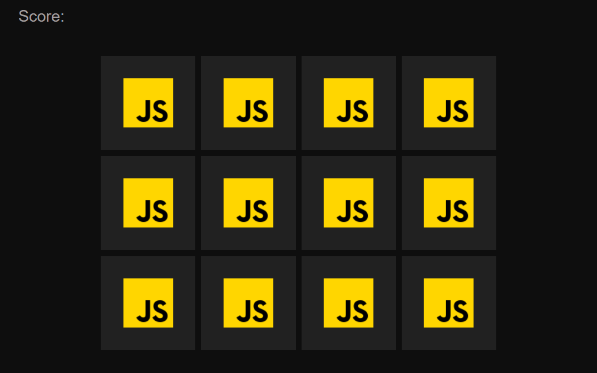

# MemoryCard.js

  

 

> Memory flip card made in javascript

 
## 🚀 Tech and Tools Used

* HTML,CSS and javascript
* VS code

## 📸 Screenshots

link:https://jaydeep-shelake.github.io/MemoryCard.js/

